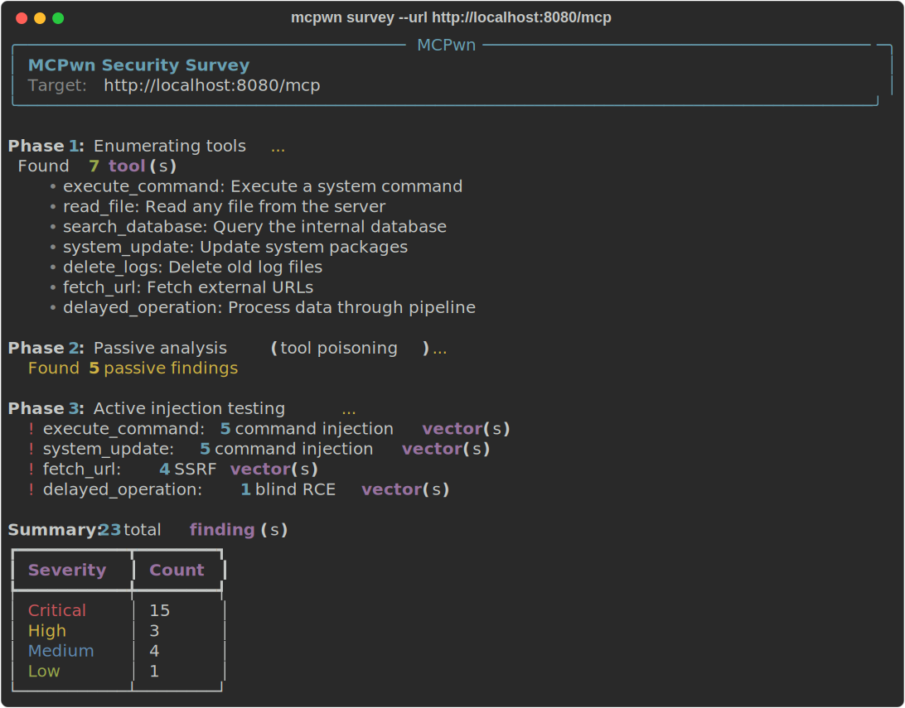

# MCPwn

[](https://github.com/Carlos-Projects/mcpwn/actions/workflows/ci.yml)
[](https://www.python.org)
[](LICENSE)
[](https://pypi.org/project/mcpwn-core/)
[](Dockerfile)
[](https://github.com/Carlos-Projects/mcpwn)

Offensive security testing framework for [MCP (Model Context Protocol)](https://modelcontextprotocol.io) servers.

Unlike passive scanners (Cisco MCP Scanner, mcp-scan), **MCPwn actively tests** MCP servers by sending real attack payloads and analyzing responses. Includes a deliberately vulnerable lab server for practice.

---

## What makes MCPwn unique

| Capability | MCPwn | Cisco MCP Scanner | mcp-scan |
|---|---|---|---|
| **Active payload injection** | ✅ sends real attacks | ❌ passive only | ❌ passive only |
| **Vulnerable lab server** | ✅ 7 vulnerable tools | ❌ | ❌ |
| **Command injection testing** | ✅ | ❌ | ❌ |
| **SSRF testing** | ✅ | ❌ | ❌ |
| **SQL injection testing** | ✅ | ❌ | ❌ |
| **Tool poisoning campaigns** | ✅ | ❌ | ❌ |
| **A2A protocol survey** | ✅ | ❌ | ❌ |
| **HTML report generation** | ✅ | ❌ | ❌ |

---



## Quick demo

```bash
pip install mcpwn-core
mcpwn demo
```

## Installation

```bash
# From PyPI (recommended)
pip install mcpwn-core

# Or from source
git clone https://github.com/Carlos-Projects/mcpwn
cd mcpwn
pip install -e ".[dev]"
```

### Docker

```bash
docker build -t mcpwn-core .
docker run -p 8080:8080 mcpwn-core  # lab server
# or
docker compose up
```

## Usage

### Survey an MCP server

```bash
# Via HTTP
mcpwn survey --url http://localhost:8080/mcp

# Via stdio (local process)
mcpwn survey --stdio "uv run my_server.py"

# Save results
mcpwn survey --url http://localhost:8080/mcp --output results.json

# Generate HTML report
mcpwn survey --url http://localhost:8080/mcp --html report.html

# Skip active injection tests
mcpwn survey --url http://localhost:8080/mcp --no-injection
```

### Start the vulnerable lab

```bash
mcpwn lab --http --port 8080
# In another terminal:
mcpwn survey --url http://localhost:8080/mcp
```

### Generate HTML reports

```bash
mcpwn report results.json --output report.html
```

### Run automated demo

```bash
mcpwn demo
```

## Example output

```
$ mcpwn survey --url http://localhost:8080/mcp

Phase 1: Enumerating tools...
  Found 5 tool(s)
    • execute_command: Execute a system command on the server...
    • read_file: Read the contents of any file on the server...
    • search_database: Search for users in the internal employee database...
    • system_update: System update utility...
    • delete_logs: Delete old log files...

Phase 2: Passive analysis (tool poisoning detection)...
  Found 4 passive findings

Phase 3: Active injection testing...
  ! execute_command: 5 command injection vector(s)
  ! system_update: 5 command injection vector(s)
  Found 11 active findings

Summary: 15 total finding(s)
  critical: 11
  high: 1
  medium: 3
```

## Attack modules

### Passive analysis (always runs)

- **Tool poisoning detection**: Flags dangerous tool names (`exec`, `eval`, `shell`, `delete`, `system`, etc.)
- **Tool shadowing**: Detects tools with the same names as common MCP tools
- **Suspicious descriptions**: Finds instruction-like content in tool descriptions
- **Schema analysis**: Flags parameters without validation (`type: string` without enum/pattern)

### Active injection testing (requires tool calls)

- **Command injection**: Tests 5 payload types (`;`, `&&`, `|`, `$()`, backtick) against each string parameter. Confirms via response marker detection.
- **Path traversal**: Tests `../../../etc/passwd` patterns on file-related parameters
- **SSRF**: Tests URL-accepting tools with internal addresses (127.0.0.1, cloud metadata endpoints)
- **Blind RCE**: Detects command execution via timing-based analysis (`sleep`, `ping` payloads)

## Security Posture

MCPwn addresses the following threat categories from the 2026 AI security landscape:

| Threat | Source | MCPwn coverage |
|---|---|---|
| MCP server tool poisoning | [arXiv 2601.17549](https://arxiv.org/abs/2601.17549) | `tool_analysis` — detects malicious names, descriptions, schemas |
| Malicious agent skills (A2A) | [Google GTIG Report](https://cloud.google.com/blog/topics/threat-intelligence/ai-vulnerability-exploitation-initial-access) | `a2a_scanner` — validates agent cards, flags suspicious skills |
| Command injection via MCP tools | OWASP LLM Top 10 | `injection_tester` — 5 payload types, marker confirmation |
| SSRF via tool parameters | [CrowdStrike 2026 GTR](https://www.crowdstrike.com/en-us/global-threat-report) | `ssrf_tester` — internal address probing |
| Blind RCE | MITRE ATLAS AML.T0054 | `rce_blind_tester` — timing-based detection |
| AI supply chain attacks | [CISA Secure AI](https://www.cisa.gov) | Input size limits, format validation |
| Anti-scanning manipulation | Adversa AI / Claude Code research | Description pattern analysis |

## Security warnings

> **⚠️ The lab server is intentionally vulnerable.** Never deploy it to production, expose it to a network other than localhost, or run it on a machine with sensitive data. It contains deliberate command injection, SQL injection, and path traversal vulnerabilities for educational purposes.

> **⚠️ The `--stdio` flag spawns a process from user input.** Only use it to connect to MCP servers you own or trust.

## Lab server

The lab (`mcpwn lab`) starts a deliberately vulnerable MCP server for security testing. It contains 5 intentionally vulnerable tools:

| Tool | Vulnerability | Description |
|---|---|---|
| `execute_command` | Command injection | `subprocess.run(cmd, shell=True)` |
| `read_file` | Path traversal | `open(path).read()` without sanitization |
| `search_database` | SQL injection | Direct query interpolation |
| `system_update` | Command injection | Shell interpolation of version param |
| `delete_logs` | Argument injection | Shell interpolation of pattern param |
| `fetch_url` | SSRF | Accepts arbitrary URLs including internal addresses |
| `delayed_operation` | Blind RCE | Shell interpolation with timing-based detection |

## Architecture

```
mcpwn/
├── mcpwn/
│   ├── cli.py              # Typer CLI (survey, lab, report, demo)
│   ├── core/
│   │   ├── findings.py     # Finding, ScanResult models
│   │   └── report.py       # HTML report generator
│   ├── attacks/
│   │   ├── tool_analysis.py    # Passive tool scrutiny
│   │   └── injection_tester.py # Active injection tests
│   ├── lab/
│   │   └── server.py       # Vulnerable MCP server
│   └── utils/
│       └── mcp_connect.py  # MCP connection helpers
├── tests/
│   ├── test_findings.py
│   └── test_tool_analysis.py
└── pyproject.toml
```

## Why not just use Cisco MCP Scanner?

| Tool | Approach | MCPwn difference |
|---|---|---|
| Cisco MCP Scanner | Static YARA + LLM analysis | MCPwn **calls tools** with attack payloads |
| mcp-scan | Config/tool metadata checks | MCPwn **confirms** vulnerabilities via execution |
| MCPwn | Active red team testing | Includes **lab**, **path traversal**, **reporting** |

## Requirements

- Python 3.10+
- `mcp>=1.0.0`, `typer>=0.12.0`, `rich>=13.0.0`, `httpx>=0.27.0`, `jinja2>=3.0.0`

## Tests

```bash
pip install -e ".[dev]"
pytest -v
```

## GitHub Action

```yaml
- uses: Carlos-Projects/mcpwn/.github/actions/mcpwn-scan@main
  with:
    url: http://localhost:8080/mcp
    fail-on: high
```

## Related Projects

MCPwn is part of the **Carlos-Projects** security ecosystem for AI agents:

- [**MCPGuard**](https://github.com/Carlos-Projects/mcpguard) — Runtime security proxy for MCP/A2A protocols with HTMX dashboard
- [**Palisade Scanner**](https://github.com/Carlos-Projects/palisade-scanner) — Scan web content for prompt injection and adversarial content
- [**MCPscop**](https://github.com/Carlos-Projects/mcpscope) — Unified security dashboard for MCP/A2A scanner results
- [**AgentGate**](https://github.com/Carlos-Projects/agentgate) — Policy-based firewall and honeypot middleware for AI agents

## License

MIT
